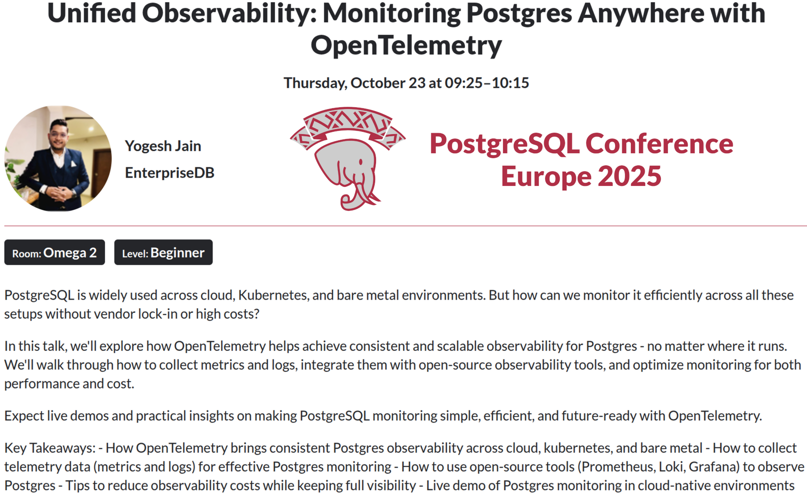

## Agenda

- Why? - The reason for this talk!
- A typical PostgreSQL Installation
- Component Logs & Metrics
- Component Configuration
- OpenTelemetry
- Demo
- Limits & Disadvantages
- Key Takeaways

---

## Proventa {auto-animate=true}

::: columns
::: {.column width="40%"}

- 

:::

::: {.column width="60%"}


:::
:::

---

## Why? - The reason for this talk! {.smaller}

[{fig-align="center" width=70%}](https://www.postgresql.eu/events/pgconfeu2025/schedule/session/7035-unified-observability-monitoring-postgres-anywhere-with-opentelemetry/)

:::{.r-stack}
**What about all the other components of a Postgres service?**
:::

---

## A typical PostgreSQL Setup

{fig-align="center"}

---

## Component Log Formats {.smaller}

|Component | Plain Text | CSV | JSON |
| --- | --- | --- | --- |
| PostgreSQL | yes | yes | yes |
| PGAudit¹ ² | yes | no | no |
| Patroni | yes | no | yes |
| pgBackRest³  | yes | no | no |
| PGBouncer | yes | no | no |

¹ Extension [pgauditlogtofile](https://github.com/fmbiete/pgauditlogtofile) offers CSV & JSON with a separate PGAudit logfile

² Request for JSON implementation: [Github issue 293](https://github.com/pgaudit/pgaudit/issues/293)

³ Request for JSON implementation: [Github issue 2619](https://github.com/pgbackrest/pgbackrest/issues/2619)

---

## Log Format Examples {.smaller}

```bash
# Postgres
LOG:  starting PostgreSQL 15.3 (Ubuntu 15.3-0ubuntu0.22.04.1) on x86_64-pc-linux-gnu, compiled by gcc (Ubuntu 11.3.0-1ubuntu1~22.04.1) 11.3.0, 64-bit
LOG:  listening on IPv4 address "127.0.0.1", port 5432

# Patroni
{"asctime": "2026-04-16 12:27:40,863", "levelname": "INFO", "message": "no action. I am (node1), the leader with the lock"}

# pgBackRest
2026-04-16 12:26:20.361 P00   INFO: new backup label = 20260416-122618F
2026-04-16 12:26:20.437 P00   INFO: full backup size = 22.9MB, file total = 978
2026-04-16 12:26:20.437 P00   INFO: backup command end: completed successfully (1769ms)

# PGBouncer
2026-04-16 12:26:47.317 UTC [147] LOG C-0x564359c703e0: postgres/testuser@[::1]:50722 login attempt: db=postgres user=testuser tls=no replication=no
2026-04-16 12:26:47.324 UTC [147] LOG S-0x564359c86438: postgres/testuser@127.0.0.1:5432 new connection to server (from 127.0.0.1:37596)

# etcd
{"level":"info","ts":"2026-04-16T12:26:12.384085Z","caller":"version/monitor.go:116","msg":"cluster version differs from storage version.","cluster-version":"3.6.0","storage-version":"3.5.0"}
```

---

## Component Metrics {.smaller}

- Postgres, pgBackRest, PGBouncer
  - No metrics endpoint
  - Available with 3rd party tools, e.g. [postgres_exporter](https://github.com/prometheus-community/postgres_exporter), [pgbackrest_exporter](https://github.com/woblerr/pgbackrest_exporter), [pgbouncer_exporter](https://github.com/prometheus-community/pgbouncer_exporter)
- Patroni, etcd
  - Prometheus compatible HTTP-Endpoint

```bash
dca# curl http://patroni:8008/metrics
# HELP patroni_version Patroni semver without periods.
# TYPE patroni_version gauge
patroni_version{scope="pgcluster1",name="node1"} 040101
...
dca# curl http://etcd:2381/metrics
# HELP etcd_cluster_version Which version is running. 1 for 'cluster_version' label with current cluster version
# TYPE etcd_cluster_version gauge
etcd_cluster_version{cluster_version="3.6"} 1
...
```

---

## Component Configuration {.smaller}

```bash
# etcd.conf
ETCD_LOGGER="zap"
ETCD_LOG_OUTPUTS="/var/log/etcd/etcd.log"
ETCD_LOG_LEVEL="info"
ETCD_LOG_FORMAT="json"
ETCD_ENABLE_LOG_ROTATION="true"
ETCD_LOG_ROTATION_CONFIG_JSON='{"maxsize": 100, "maxage": 1, "maxbackups": 7, "localtime": true, "compress": true}'
```

::: columns
::: {.column width="60%"}

```bash
# patroni.yml - Postgres Logging
bootstrap:
  dcs:
    postgresql:
      parameters:
        log_destination: 'jsonlog'
        logging_collector: 'on'
        log_directory: '/var/log/postgres'
        log_filename: 'postgresql-%a.log'
        log_file_mode: '0640'
        log_truncate_on_rotation: 'on'
        log_rotation_age: '1d'
        log_rotation_size: '1GB'
        log_min_messages: 'warning'
        log_min_error_statement: 'error'
        log_connections: 'on'
        log_disconnections: 'on'
        log_error_verbosity: 'verbose'
        log_hostname: 'off'
        log_line_prefix: '%m [%r] [%p]: [l-%l] %u@%d,app=%a,e=%e '
        log_statement: 'none'
        log_timezone: 'UTC'
```

:::

::: {.column width="40%"}

```bash
# patroni.yml - Patroni Logging
log:
  type: json
  dir: /var/log/patroni
  mode: 0644
  level: INFO
```

```bash
# pgbackrest.conf
log-path=/var/log/pgbackrest
log-level-console=info
log-level-file=info
```

```ini
# pgbouncer.ini
[pgbouncer]
logfile = /var/log/pgbouncer/pgbouncer.log
pidfile = /run/pgbouncer/pgbouncer.pid
log_connections = 1
log_disconnections = 1
log_pooler_errors = 1
log_stats = 0
```

:::
:::

---

## OpenTelemetry {.smaller}

- [OpenTelemetry](https://opentelemetry.io/) (OTel) is an open source observability framework
- Developed by the Cloud Native Computing Foundation (CNCF)
  - Provides vendor-neutral SDKs, APIs, & tools
- Collects, processes, & exports telemetry data (logs, metrics, & traces) in a single, unified format
- Exports to any observability backend, e.g. like Jaeger & Prometheus

::: {.callout-important}
**OpenTelemetry becomes the dominant observability telemetry standard in cloud-native applications and its adoption is considered critical.**
:::

## OpenTelemetry Collector {.smaller}

- [OTel Collector](https://opentelemetry.io/docs/collector/) is a vendor-agnostic implementation of how to receive, process & export telemetry data
  - Serves as unified agent / collector
- [OTel Collector Contrib](https://github.com/open-telemetry/opentelemetry-collector-contrib) repository offers many recievers, processors & exporters

{fig-align=center}

## Demo Setup {.smaller}

::: columns
::: {.column width="40%"}

- Rocky Linux 10 UBI container image
  - systemd (privileged)
  - etcd
  - PostgreSQL v18
    - PGAudit
  - Patroni
  - pgBackRest
  - Pgbouncer
  - OTel Collector Contrib
- Configuration copied into the container image

:::

::: {.column width="60%"}

```bash
# host
dca# git clone https://github.com/dirkcaumueller/otel-poc.git
dca# git checkout -b pgconf
dca# cd otel-poc
dca# chmod +x init.sh
dca# ./init.sh
dca# docker exec -it node1 bash

# container
root# systemctl start etcd
root# systemctl start patroni
root# systemctl start pgbouncer
root# systemctl start otelcol-contrib
```

::: {.callout-caution}
- Not production ready!
- No mounts / volumes used - data is ephemeral!
- Credentials: username = password
:::

:::
:::

---

## OTel Collector Binary {.smaller}

- Different installation methods available
  - Docker, rpm, binary, ...
- Configuration via YAML file(s)

```bash
dca# otelcol-contrib --version
otelcol-contrib version 0.150.1

dca# otelcol-contrib --help
Usage:
  otelcol-contrib [flags]
  otelcol-contrib [command]

Available Commands:
  completion   Generate the autocompletion script for the specified shell
...

dca# otelcol-contrib --config=/etc/otelcol-contrib/otelcol-config.yaml
```

---

## OTel Collector Configuration {.smaller}

```yaml
receivers:                        # Collect data from sources
  postgresql:                     # Dedicated receiver for PostgreSQL metrics
    endpoint: 127.0.0.1:5432
    transport: tcp
    username: otel
    password: otel
    collection_interval: 10s
    databases:
      - postgres

processors:                        # Modify or transform data
  batch:
    timeout: 10s

exporters:                         # Pull / push based export of data
  prometheus:
  endpoint: '0.0.0.0:8900'

service:                           # Configure & enable components based on the configuration found
  pipelines:                       # Consists of a set of receivers, processors & exporters
    metrics:                       # Pipeline to publish Postgres metrics at Prometheus compatible http-endpoint
      receivers: [postgresql]
      processors: [batch]
      exporters: [prometheus]
```

---

## OTel Collector Receivers {.smaller}

```yaml
receivers:
  file_log/pgbouncer:                             # Use file receiver
    include: [/var/log/pgbouncer/pgbouncer.log]
    start_at: end
    operators:                                    # Perform "little" tasks
      - type: regex_parser
        regex: '^(?<timestamp>\d{4}-\d{2}-\d{2} \d{2}:\d{2}:\d{2}\.\d{3} [A-Z]{3}) \[(?<pid>\d+)\] (?<error_severity>[A-Z]+) (?<message>.*)$'
        timestamp:
          parse_from: attributes.timestamp
          layout: '%Y-%m-%d %H:%M:%S.%f %Z'
        severity:
          parse_from: attributes.error_severity
          mapping:
            debug:
              - DEBUG
              - NOISE
            info: LOG
            warn: WARNING
            error: ERROR
            fatal: FATAL
      - type: move                                # Move attributes in common JSON structure
        if: attributes["pid"] != nil
        from: attributes["pid"]
        to: attributes["process.pid"]
      - type: move
        if: body != nil
        from: body
        to: attributes["log.record.original"]
      # Must be last operator-action
      - type: move
        if: "attributes.message != nil"
        from: attributes["message"]
        to: body
```

---

## OTel Attributes {.smaller}

- OTel defines a standardised set of common terms which are called attributes
- [General attributes](https://opentelemetry.io/docs/specs/semconv/general/attributes/), e.g.
  - server.address
  - server.port
- Specific attributes, e.g.
  - db.system.name
  - deployment.status
- [Attribute Registry](https://opentelemetry.io/docs/specs/semconv/registry/attributes/)

---

## OTel Processors {.smaller}

```yaml
processors:
  memory_limiter:                # Prevents out of memory situations on the collector
    check_interval: 1s
    limit_percentage: 10
    spike_limit_percentage: 5
  resourcedetection/system:      # Detect resource information from the host
    detectors: ["system"]
    system:
      hostname_sources: ["dns"]  # Get the fully qualified domain name
  resource:                      # Add static information about data's origin
    attributes:
      - key: service.name
        value: pg-db
        action: upsert
      - key: db.system.name
        value: postgresql
        action: upsert
      - key: deployment.environment.name
        value: development
        action: upsert
  batch:               # Creates batches to better compress data & reduction of outgoing connections
    timeout: 10s
``` 

---

## OTel Collector Services {.smaller}

```yaml
service:
  pipelines:
    metrics:
      receivers: [sqlquery/custom, postgresql]
      processors: [memory_limiter, resourcedetection/system, resource, batch]
      exporters: [prometheus]
    metrics/2:
      receivers: [sqlquery/pgbouncer]
      processors: [memory_limiter, resourcedetection/system, resource, batch]
      exporters: [prometheus/2]
    metrics/3:
      receivers: [sqlquery/pgbackrest]
      processors: [memory_limiter, resourcedetection/system, resource, batch]
      exporters: [prometheus/3]

    logs:
      receivers: [file_log/postgresql, file_log/patroni, file_log/pgbouncer, file_log/pgbackrest]
      processors: [memory_limiter, resourcedetection/system, resource, batch]
      exporters: [file/rotation_with_custom_settings]
```

---

## Live Demo {.smaller}

{fig-align="center"}

:::{.r-stack}
[https://github.com/dirkcaumueller/otel-poc](https://github.com/dirkcaumueller/otel-poc)
:::


---

## Disadvantages & Limits {.smaller}

- Resource overhead
  - Collector processes consume CPU & memory, especially at high throughput
- Configuration verbosity
  - YAML pipelines can become large & hard to manage
- Steep learning curve
  - Pipelines, processors, exporters, and receivers have many moving parts
- Debugging is hard
  - Troubleshooting dropped or malformed telemetry in the pipeline is non-trivial
- Version instability
  - Components (especially contrib receivers) vary in maturity

---

## Key Takeaways {.smaller}

- OTel provides vendor-neutral observability
  - Avoid lock-in to any single monitoring tool
- Unified telemetry (metrics, traces, logs) in one pipeline reduces Postgres tooling sprawl
- End-to-end visibility from app code through connection pool to database
- Faster mean time to detect and resolve incidents
- Scales with your infrastructure
  - Same approach works from single node to large Postgres HA clusters
  - Environment agnostic (cloud native, hybrid, traditional)

---

## Thank you!

{fig-align="center"}


